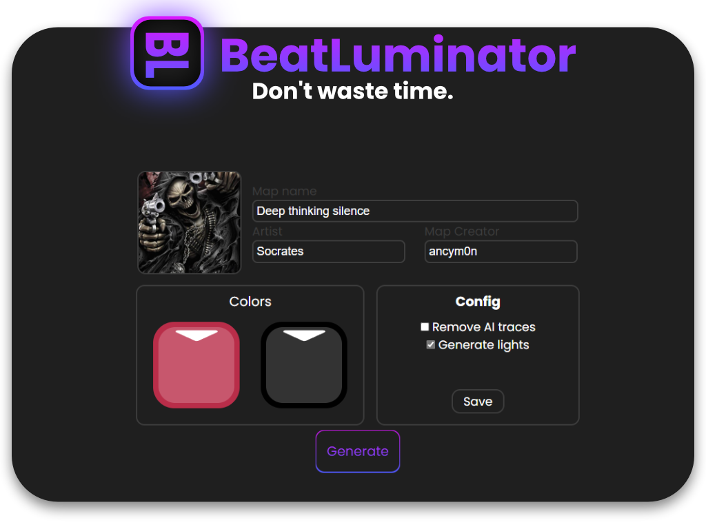

# BeatLuminator

Interactive GUI application for generating custom light events in Beat Saber.

## 🚀 How to Use

1. Download the [**latest release**](https://github.com/ancym0n/BeatLuminator/releases) (`.msi` file).
2. Generate your map using [BeatSage](https://beatsage.com/).
3. Open **BeatLuminator**, click _Browse Files_, and select your `.zip` file from BeatSage.

## ✨ Features

- **Change song cover** – Simply click the cover image to update it.
- **Customize block colors** – Click a block to modify its color.
- **Edit basic song details** – Easily adjust title, artist, and more.
- **Remove AI traces** – Clean up your map effortlessly.
